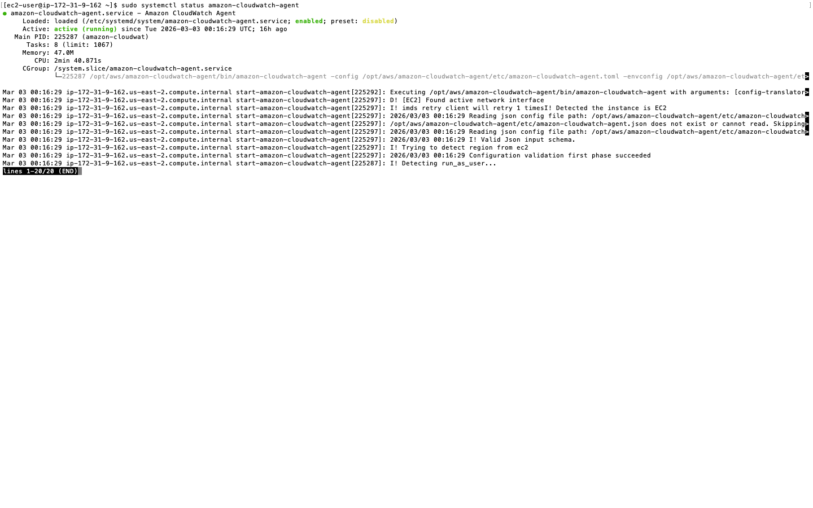
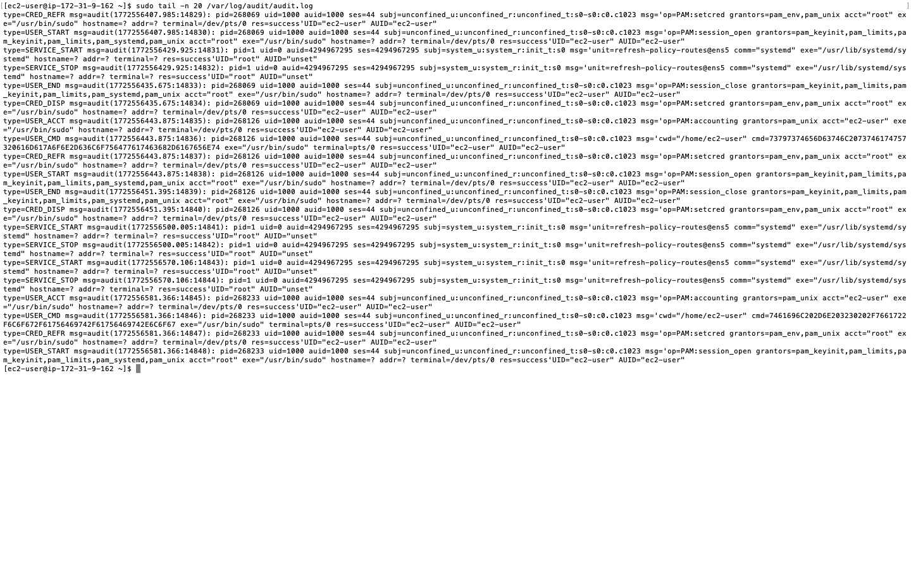
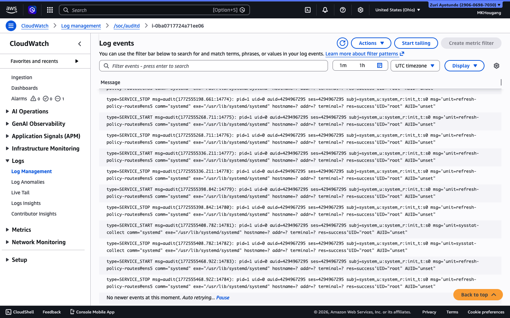
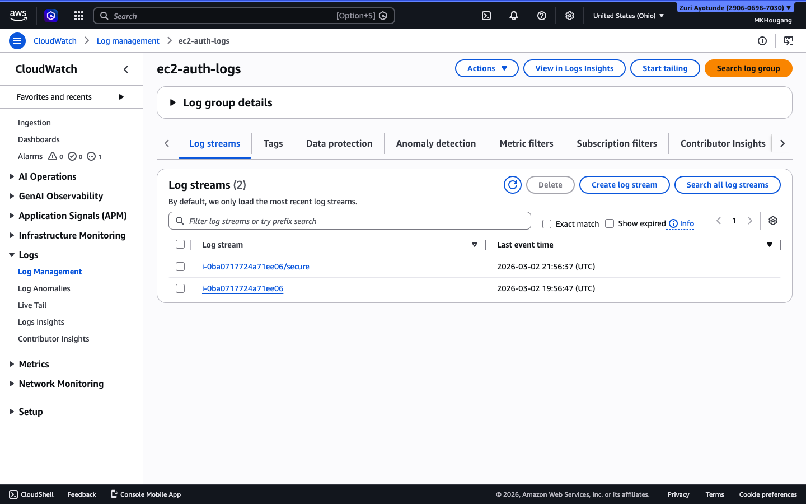
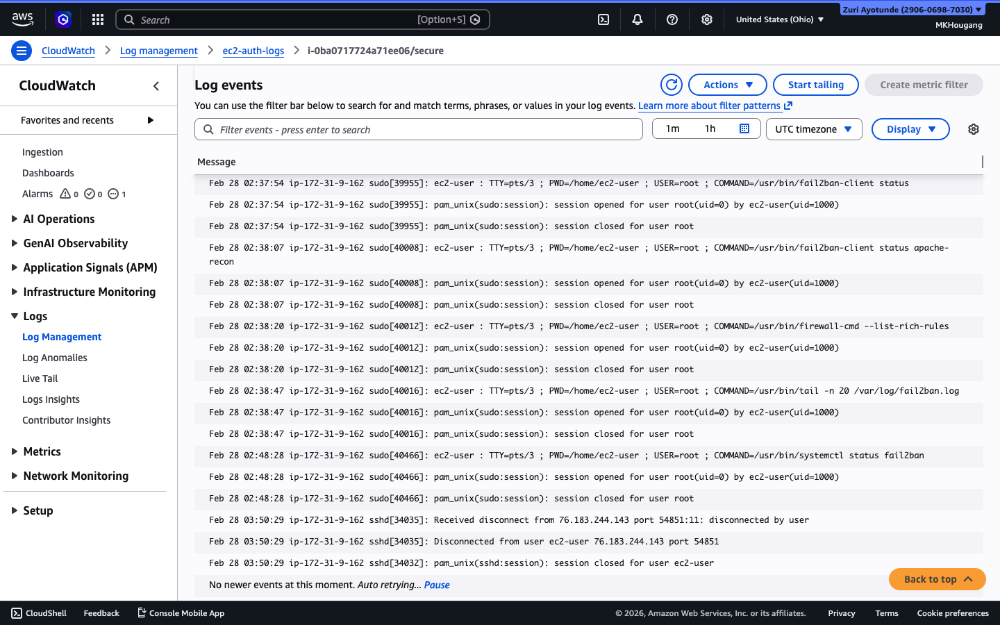
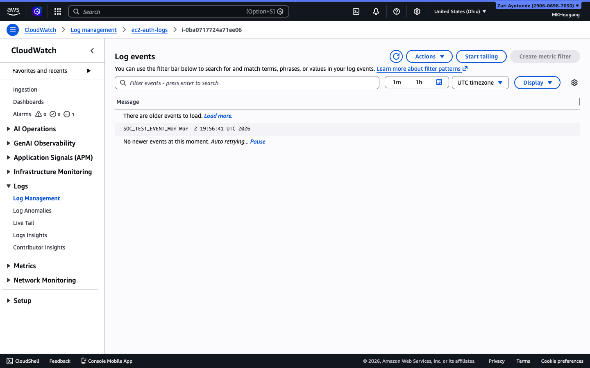

# AWS CloudWatch Log Monitoring Lab

## Objective

Configure and validate AWS CloudWatch log ingestion from an Amazon Linux 2023 EC2 instance.  
Demonstrate cloud logging visibility and audit readiness aligned with SOC monitoring practices.

---

## Environment

- AWS Region: US East (Ohio) – us-east-2
- EC2 OS: Amazon Linux 2023
- Services Used:
  - CloudWatch Logs
  - EC2
  - IAM
- Access Method: SSH via macOS Terminal

---

## Implementation Steps

### 1️⃣ EC2 Instance Access

Connected via SSH:

```bash
ssh soc-lab
```

---

### 3️⃣ CloudWatch Log Group Verification

Validated the following log groups in AWS CloudWatch:

- `/soc/auditd`
- `ec2-audit-logs`
- `ec2-auth-logs`

Navigation path:

CloudWatch → Logs → Log groups → Log stream

Confirmed:
- Log groups indexed
- Log streams active
- Event entries visible
- Ingestion functioning properly

---

## Evidence

### 1️⃣ CloudWatch Agent Status

The Amazon CloudWatch Agent was verified running on the EC2 instance:

- Service: `amazon-cloudwatch-agent`
- Status: `active (running)`
- Log forwarding operational



---

### 2️⃣ Local Audit Log Generation

Verified that auditd is actively generating syscall-level events locally:

- File monitored: `/var/log/audit/audit.log`
- Events observed: `USER_CMD`, `USER_START`, `SERVICE_START`, etc.
- Confirms host-level activity is being logged prior to forwarding



---

### 3️⃣ Active Log Group Ingestion

#### `/soc/auditd`

- Log stream: `i-0ba0717724a71ee06`
- System-level audit events visible
- Recent timestamps confirmed
- Continuous ingestion observed



---

### 4️⃣ Authentication Log Monitoring (`ec2-auth-logs`)

Authentication logs successfully forwarded to CloudWatch.

**Active Log Streams:**
- `i-0ba0717724a71ee06`
- `i-0ba0717724a71ee06/secure`



**Authentication Events Observed:**
- `sudo` activity
- `pam_unix` session events
- SSH disconnect events
- Root privilege escalation attempts



---

### 5️⃣ SOC Validation Test Event

A custom SOC validation event was manually generated to confirm end-to-end log ingestion:

Event observed in CloudWatch:

SOC_TEST_EVENT Mon Mar 2 19:56:41 UTC 2026


This confirms:
- Manual event generation
- Successful ingestion pipeline
- Real-time log visibility
- Validation testing methodology



---

### 6️⃣ Log Group Lifecycle Behavior Observation

The original `ec2-audit-logs` group was deleted and recreated during testing.

**Findings:**
- Log streams do not persist after deletion.
- Recreating a log group does not restore prior streams.
- CloudWatch Agent forwards only to configured log group targets.
- Active ingestion currently targets `/soc/auditd` and `ec2-auth-logs`.

This demonstrates operational awareness of CloudWatch log group lifecycle and forwarding dependencies.